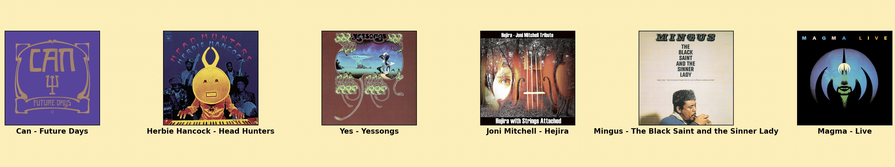

# Album-Recommender

This is an album recommender system using the top charted albums of all time on RateYourMusic.

1. Obtained a list of top 5,000 albums and their metadata from RateYourMusic and read them into a CSV. The metadata for each album includes release date, primary genre(s), overall rating, number of ratings, and number of reviews.

2. Obtained the audio metrics for every track on each album.

3. Cleaned the data and assigned numerical values to non-numerical features/parameters.

3. Developed a K-Nearest-Neighbours model (using SKlearn). The general idea can be thought of simplest in 2-dimensions. For example, x = Energy (a spotify audio track metric) and y = Danceability (another spotify audio track metric). Each album on the graph is defined as a point, with some Energy x and some Danceability y. In an ideal model, albums on this x,y graph would be clustered by genre (ex. Jazz albums close to one another, Indie-Rock, Soul, etc.). In reality, the model has a non-visualizable number of dimensions, one for each feature. Albums are points in some n-dimensional space.

For example, inputting the album Future Days by Can, the following 5 albums to its right are the most recommended based on the model I developed (most to least similar from left to right).

4. Now in process of playing with features and weights for an ideal and accurate model. 
